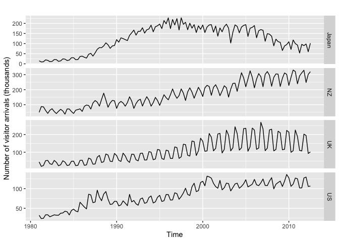

1Graphics
================

# Basics of Time Series Objects

The aim of this section is to get you familiar with time series objects
in R. Unlike the standard objects such as lists, data frames, matrices
and vectors, time series objects have various attributes associated with
them.

For this course, we will mainly be working with ts objects which are
already in the base package. There are other types of time series
objects such as xts and zoo, which have their own manipulation methods.

Load the Singapore Real GDP (seasonally adjusted) dataset.

``` r
knitr::opts_chunk$set(message=FALSE)
```

``` r
gdp <- read.csv("SGRGDP.csv")
head(gdp)
```

    ##      Date SG_RGDP
    ## 1 1975 Q1  7558.3
    ## 2 1975 Q2  7693.9
    ## 3 1975 Q3  7848.9
    ## 4 1975 Q4  7960.6
    ## 5 1976 Q1  8183.3
    ## 6 1976 Q2  8260.3

Notice that the left column contains the dates. While it is useful to
note the start and end dates of the dataset, we can remove this column
once we create the ts object.

``` r
gdp.ts <- ts(gdp[,2], start=c(1975,1), end=c(2019,2), frequency=4)
gdp.ts
```

    ##          Qtr1     Qtr2     Qtr3     Qtr4
    ## 1975   7558.3   7693.9   7848.9   7960.6
    ## 1976   8183.3   8260.3   8421.3   8509.6
    ## 1977   8698.2   8877.8   8967.5   9118.0
    ## 1978   9192.8   9411.4   9777.0  10044.2
    ## 1979  10070.6  10401.3  10591.0  11043.7
    ## 1980  11225.4  11450.8  11704.2  12002.0
    ## 1981  12358.6  12743.9  13021.7  13280.2
    ## 1982  13452.1  13665.7  13869.6  14074.0
    ## 1983  14441.5  14750.7  15055.7  15508.2
    ## 1984  15999.0  16190.3  16381.0  16438.6
    ## 1985  16629.3  16175.3  15993.3  15822.5
    ## 1986  15974.3  16182.3  16439.8  16861.2
    ## 1987  17272.6  17821.9  18443.7  18979.4
    ## 1988  19191.2  19965.4  20501.5  21037.4
    ## 1989  21064.0  22263.9  22526.1  23039.3
    ## 1990  23989.0  24235.5  24513.6  24903.8
    ## 1991  25499.9  25857.6  26287.8  26497.7
    ## 1992  26961.0  27282.6  28024.7  28769.1
    ## 1993  29405.2  30672.9  31221.1  32444.1
    ## 1994  33435.5  33824.6  34882.3  35382.2
    ## 1995  35198.2  36238.9  37818.6  38160.3
    ## 1996  39401.2  39360.2  39363.4  40410.5
    ## 1997  41632.2  43021.9  43704.9  43344.8
    ## 1998  42219.5  41911.6  41558.9  42306.8
    ## 1999  43063.0  44150.8  44974.0  45358.3
    ## 2000  46748.5  47718.6  49373.8  49746.6
    ## 2001  49305.9  48028.9  46955.7  47263.4
    ## 2002  48698.9  50094.7  50127.0  50044.3
    ## 2003  50712.4  50016.0  52842.8  54340.6
    ## 2004  55957.2  56784.6  57171.5  58486.9
    ## 2005  58857.7  60385.6  61933.3  63995.8
    ## 2006  65052.4  65764.0  66983.8  69568.6
    ## 2007  70635.1  72273.5  74137.6  74475.8
    ## 2008  76430.2  74492.5  73932.3  72296.9
    ## 2009  70443.3  73399.2  76117.2  77348.9
    ## 2010  81708.5  86776.8  84303.8  87726.4
    ## 2011  89326.1  89176.0  91271.0  91957.7
    ## 2012  93742.9  94528.6  93538.4  95986.4
    ## 2013  96887.5  98913.5  99549.1 100515.1
    ## 2014 101180.2 102303.4 103170.1 104711.4
    ## 2015 104223.1 105523.5 106758.7 106819.6
    ## 2016 107455.4 108357.2 109127.1 111000.1
    ## 2017 111342.6 111752.7 113992.1 114996.7
    ## 2018 116379.6 116575.3 116817.0 116569.5
    ## 2019 117660.0 116676.8

Hence, ts objects contain both the series and assign the period as an
attribute. The start and end dates should be specified using a vector
containing the year and period within the year. The latter should be
specified as the number of intervals in a year depending on the sampling
frequency (1 for annual, 4 for quarterly, 12 for monthly, 52 for weekly,
etc.). In this example, we have data from 1975Q1 to 2019Q2. Note that
most functions using ts objects require integer frequency, thus we
should not specify weekly frequency as 365.25/7=52.18.

As with any analysis, we should always visualise the series first.

``` r
library(gridExtra)
library(fpp2)
```

    ## Warning: package 'fpp2' was built under R version 3.6.2

    ## Warning: package 'ggplot2' was built under R version 3.6.2

    ## Warning: package 'forecast' was built under R version 3.6.2

``` r
ptheme <- theme(aspect.ratio = 2/3, text=element_text(size=10), 
                 axis.title = element_text(size=9))
autoplot(gdp.ts) + ylab("Real GDP (Seasonally Adjusted)") + xlab("Year") + ptheme + ggtitle("Singapore Real GDP (Seasonally Adjusted)") 
```

<!-- -->

The autoplot() function is versatile enough to recognise the type of
object passed through it. In this example, it recognised the ts object
and automatically generated a time series plot.

To change the sample range by date, use the window() function. Note that
you do not need to specify the frequency again. To change the range
using observation numbers, use the subset() function:

``` r
window(gdp.ts, start=c(2000,1))
```

    ##          Qtr1     Qtr2     Qtr3     Qtr4
    ## 2000  46748.5  47718.6  49373.8  49746.6
    ## 2001  49305.9  48028.9  46955.7  47263.4
    ## 2002  48698.9  50094.7  50127.0  50044.3
    ## 2003  50712.4  50016.0  52842.8  54340.6
    ## 2004  55957.2  56784.6  57171.5  58486.9
    ## 2005  58857.7  60385.6  61933.3  63995.8
    ## 2006  65052.4  65764.0  66983.8  69568.6
    ## 2007  70635.1  72273.5  74137.6  74475.8
    ## 2008  76430.2  74492.5  73932.3  72296.9
    ## 2009  70443.3  73399.2  76117.2  77348.9
    ## 2010  81708.5  86776.8  84303.8  87726.4
    ## 2011  89326.1  89176.0  91271.0  91957.7
    ## 2012  93742.9  94528.6  93538.4  95986.4
    ## 2013  96887.5  98913.5  99549.1 100515.1
    ## 2014 101180.2 102303.4 103170.1 104711.4
    ## 2015 104223.1 105523.5 106758.7 106819.6
    ## 2016 107455.4 108357.2 109127.1 111000.1
    ## 2017 111342.6 111752.7 113992.1 114996.7
    ## 2018 116379.6 116575.3 116817.0 116569.5
    ## 2019 117660.0 116676.8

``` r
subset(gdp.ts, start=1, end=100)
```

    ##         Qtr1    Qtr2    Qtr3    Qtr4
    ## 1975  7558.3  7693.9  7848.9  7960.6
    ## 1976  8183.3  8260.3  8421.3  8509.6
    ## 1977  8698.2  8877.8  8967.5  9118.0
    ## 1978  9192.8  9411.4  9777.0 10044.2
    ## 1979 10070.6 10401.3 10591.0 11043.7
    ## 1980 11225.4 11450.8 11704.2 12002.0
    ## 1981 12358.6 12743.9 13021.7 13280.2
    ## 1982 13452.1 13665.7 13869.6 14074.0
    ## 1983 14441.5 14750.7 15055.7 15508.2
    ## 1984 15999.0 16190.3 16381.0 16438.6
    ## 1985 16629.3 16175.3 15993.3 15822.5
    ## 1986 15974.3 16182.3 16439.8 16861.2
    ## 1987 17272.6 17821.9 18443.7 18979.4
    ## 1988 19191.2 19965.4 20501.5 21037.4
    ## 1989 21064.0 22263.9 22526.1 23039.3
    ## 1990 23989.0 24235.5 24513.6 24903.8
    ## 1991 25499.9 25857.6 26287.8 26497.7
    ## 1992 26961.0 27282.6 28024.7 28769.1
    ## 1993 29405.2 30672.9 31221.1 32444.1
    ## 1994 33435.5 33824.6 34882.3 35382.2
    ## 1995 35198.2 36238.9 37818.6 38160.3
    ## 1996 39401.2 39360.2 39363.4 40410.5
    ## 1997 41632.2 43021.9 43704.9 43344.8
    ## 1998 42219.5 41911.6 41558.9 42306.8
    ## 1999 43063.0 44150.8 44974.0 45358.3

Write your own code below to (1) load the US Real GDP (Seasonally
Adjusted) series from a csv file “USRGDP.csv”, (2) create a ts object
usgdp.ts; and (3) plot the series

``` r
usgdp <- read.csv("USRGDP.csv")
usgdp
```

    ##        Date   US_RGDP
    ## 1   1947 Q1  2033.061
    ## 2   1947 Q2  2027.639
    ## 3   1947 Q3  2023.452
    ## 4   1947 Q4  2055.103
    ## 5   1948 Q1  2086.017
    ## 6   1948 Q2  2120.450
    ## 7   1948 Q3  2132.598
    ## 8   1948 Q4  2134.981
    ## 9   1949 Q1  2105.562
    ## 10  1949 Q2  2098.380
    ## 11  1949 Q3  2120.044
    ## 12  1949 Q4  2102.251
    ## 13  1950 Q1  2184.872
    ## 14  1950 Q2  2251.507
    ## 15  1950 Q3  2338.514
    ## 16  1950 Q4  2383.291
    ## 17  1951 Q1  2415.660
    ## 18  1951 Q2  2457.517
    ## 19  1951 Q3  2508.166
    ## 20  1951 Q4  2513.690
    ## 21  1952 Q1  2540.550
    ## 22  1952 Q2  2546.022
    ## 23  1952 Q3  2564.401
    ## 24  1952 Q4  2648.621
    ## 25  1953 Q1  2697.855
    ## 26  1953 Q2  2718.709
    ## 27  1953 Q3  2703.411
    ## 28  1953 Q4  2662.482
    ## 29  1954 Q1  2649.755
    ## 30  1954 Q2  2652.643
    ## 31  1954 Q3  2682.601
    ## 32  1954 Q4  2735.091
    ## 33  1955 Q1  2813.212
    ## 34  1955 Q2  2858.988
    ## 35  1955 Q3  2897.598
    ## 36  1955 Q4  2914.993
    ## 37  1956 Q1  2903.671
    ## 38  1956 Q2  2927.665
    ## 39  1956 Q3  2925.035
    ## 40  1956 Q4  2973.179
    ## 41  1957 Q1  2992.219
    ## 42  1957 Q2  2985.663
    ## 43  1957 Q3  3014.919
    ## 44  1957 Q4  2983.727
    ## 45  1958 Q1  2906.274
    ## 46  1958 Q2  2925.379
    ## 47  1958 Q3  2993.068
    ## 48  1958 Q4  3063.085
    ## 49  1959 Q1  3121.936
    ## 50  1959 Q2  3192.380
    ## 51  1959 Q3  3194.653
    ## 52  1959 Q4  3203.759
    ## 53  1960 Q1  3275.757
    ## 54  1960 Q2  3258.088
    ## 55  1960 Q3  3274.029
    ## 56  1960 Q4  3232.009
    ## 57  1961 Q1  3253.826
    ## 58  1961 Q2  3309.059
    ## 59  1961 Q3  3372.581
    ## 60  1961 Q4  3438.721
    ## 61  1962 Q1  3500.054
    ## 62  1962 Q2  3531.683
    ## 63  1962 Q3  3575.070
    ## 64  1962 Q4  3586.827
    ## 65  1963 Q1  3625.981
    ## 66  1963 Q2  3666.669
    ## 67  1963 Q3  3747.278
    ## 68  1963 Q4  3771.845
    ## 69  1964 Q1  3851.366
    ## 70  1964 Q2  3893.296
    ## 71  1964 Q3  3954.121
    ## 72  1964 Q4  3966.335
    ## 73  1965 Q1  4062.311
    ## 74  1965 Q2  4113.629
    ## 75  1965 Q3  4205.086
    ## 76  1965 Q4  4301.973
    ## 77  1966 Q1  4406.693
    ## 78  1966 Q2  4421.747
    ## 79  1966 Q3  4459.195
    ## 80  1966 Q4  4495.777
    ## 81  1967 Q1  4535.591
    ## 82  1967 Q2  4538.370
    ## 83  1967 Q3  4581.309
    ## 84  1967 Q4  4615.853
    ## 85  1968 Q1  4709.993
    ## 86  1968 Q2  4788.688
    ## 87  1968 Q3  4825.799
    ## 88  1968 Q4  4844.779
    ## 89  1969 Q1  4920.605
    ## 90  1969 Q2  4935.564
    ## 91  1969 Q3  4968.164
    ## 92  1969 Q4  4943.935
    ## 93  1970 Q1  4936.594
    ## 94  1970 Q2  4943.600
    ## 95  1970 Q3  4989.159
    ## 96  1970 Q4  4935.693
    ## 97  1971 Q1  5069.746
    ## 98  1971 Q2  5097.179
    ## 99  1971 Q3  5139.128
    ## 100 1971 Q4  5151.245
    ## 101 1972 Q1  5245.974
    ## 102 1972 Q2  5365.045
    ## 103 1972 Q3  5415.712
    ## 104 1972 Q4  5506.396
    ## 105 1973 Q1  5642.669
    ## 106 1973 Q2  5704.098
    ## 107 1973 Q3  5674.100
    ## 108 1973 Q4  5727.960
    ## 109 1974 Q1  5678.713
    ## 110 1974 Q2  5692.210
    ## 111 1974 Q3  5638.411
    ## 112 1974 Q4  5616.526
    ## 113 1975 Q1  5548.156
    ## 114 1975 Q2  5587.800
    ## 115 1975 Q3  5683.444
    ## 116 1975 Q4  5759.972
    ## 117 1976 Q1  5889.500
    ## 118 1976 Q2  5932.711
    ## 119 1976 Q3  5965.265
    ## 120 1976 Q4  6008.504
    ## 121 1977 Q1  6079.494
    ## 122 1977 Q2  6197.686
    ## 123 1977 Q3  6309.514
    ## 124 1977 Q4  6309.652
    ## 125 1978 Q1  6329.791
    ## 126 1978 Q2  6574.390
    ## 127 1978 Q3  6640.497
    ## 128 1978 Q4  6729.755
    ## 129 1979 Q1  6741.854
    ## 130 1979 Q2  6749.063
    ## 131 1979 Q3  6799.200
    ## 132 1979 Q4  6816.203
    ## 133 1980 Q1  6837.641
    ## 134 1980 Q2  6696.753
    ## 135 1980 Q3  6688.794
    ## 136 1980 Q4  6813.535
    ## 137 1981 Q1  6947.042
    ## 138 1981 Q2  6895.559
    ## 139 1981 Q3  6978.135
    ## 140 1981 Q4  6902.105
    ## 141 1982 Q1  6794.878
    ## 142 1982 Q2  6825.876
    ## 143 1982 Q3  6799.781
    ## 144 1982 Q4  6802.497
    ## 145 1983 Q1  6892.144
    ## 146 1983 Q2  7048.982
    ## 147 1983 Q3  7189.896
    ## 148 1983 Q4  7339.893
    ## 149 1984 Q1  7483.371
    ## 150 1984 Q2  7612.668
    ## 151 1984 Q3  7686.059
    ## 152 1984 Q4  7749.151
    ## 153 1985 Q1  7824.247
    ## 154 1985 Q2  7893.136
    ## 155 1985 Q3  8013.674
    ## 156 1985 Q4  8073.239
    ## 157 1986 Q1  8148.603
    ## 158 1986 Q2  8185.303
    ## 159 1986 Q3  8263.639
    ## 160 1986 Q4  8308.021
    ## 161 1987 Q1  8369.930
    ## 162 1987 Q2  8460.233
    ## 163 1987 Q3  8533.635
    ## 164 1987 Q4  8680.162
    ## 165 1988 Q1  8725.006
    ## 166 1988 Q2  8839.641
    ## 167 1988 Q3  8891.435
    ## 168 1988 Q4  9009.913
    ## 169 1989 Q1  9101.508
    ## 170 1989 Q2  9170.977
    ## 171 1989 Q3  9238.923
    ## 172 1989 Q4  9257.128
    ## 173 1990 Q1  9358.289
    ## 174 1990 Q2  9392.251
    ## 175 1990 Q3  9398.499
    ## 176 1990 Q4  9312.937
    ## 177 1991 Q1  9269.367
    ## 178 1991 Q2  9341.642
    ## 179 1991 Q3  9388.845
    ## 180 1991 Q4  9421.565
    ## 181 1992 Q1  9534.346
    ## 182 1992 Q2  9637.732
    ## 183 1992 Q3  9732.979
    ## 184 1992 Q4  9834.510
    ## 185 1993 Q1  9850.973
    ## 186 1993 Q2  9908.347
    ## 187 1993 Q3  9955.641
    ## 188 1993 Q4 10091.049
    ## 189 1994 Q1 10188.954
    ## 190 1994 Q2 10327.019
    ## 191 1994 Q3 10387.382
    ## 192 1994 Q4 10506.372
    ## 193 1995 Q1 10543.644
    ## 194 1995 Q2 10575.100
    ## 195 1995 Q3 10665.060
    ## 196 1995 Q4 10737.478
    ## 197 1996 Q1 10817.896
    ## 198 1996 Q2 10998.322
    ## 199 1996 Q3 11096.976
    ## 200 1996 Q4 11212.205
    ## 201 1997 Q1 11284.587
    ## 202 1997 Q2 11472.137
    ## 203 1997 Q3 11615.636
    ## 204 1997 Q4 11715.393
    ## 205 1998 Q1 11832.486
    ## 206 1998 Q2 11942.032
    ## 207 1998 Q3 12091.614
    ## 208 1998 Q4 12287.000
    ## 209 1999 Q1 12403.293
    ## 210 1999 Q2 12498.694
    ## 211 1999 Q3 12662.385
    ## 212 1999 Q4 12877.593
    ## 213 2000 Q1 12924.179
    ## 214 2000 Q2 13160.842
    ## 215 2000 Q3 13178.419
    ## 216 2000 Q4 13260.506
    ## 217 2001 Q1 13222.690
    ## 218 2001 Q2 13299.984
    ## 219 2001 Q3 13244.784
    ## 220 2001 Q4 13280.859
    ## 221 2002 Q1 13397.002
    ## 222 2002 Q2 13478.152
    ## 223 2002 Q3 13538.072
    ## 224 2002 Q4 13559.032
    ## 225 2003 Q1 13634.253
    ## 226 2003 Q2 13751.543
    ## 227 2003 Q3 13985.073
    ## 228 2003 Q4 14145.645
    ## 229 2004 Q1 14221.147
    ## 230 2004 Q2 14329.523
    ## 231 2004 Q3 14464.984
    ## 232 2004 Q4 14609.876
    ## 233 2005 Q1 14771.602
    ## 234 2005 Q2 14839.782
    ## 235 2005 Q3 14972.054
    ## 236 2005 Q4 15066.597
    ## 237 2006 Q1 15267.026
    ## 238 2006 Q2 15302.705
    ## 239 2006 Q3 15326.368
    ## 240 2006 Q4 15456.928
    ## 241 2007 Q1 15493.328
    ## 242 2007 Q2 15582.085
    ## 243 2007 Q3 15666.738
    ## 244 2007 Q4 15761.967
    ## 245 2008 Q1 15671.383
    ## 246 2008 Q2 15752.308
    ## 247 2008 Q3 15667.032
    ## 248 2008 Q4 15328.027
    ## 249 2009 Q1 15155.940
    ## 250 2009 Q2 15134.117
    ## 251 2009 Q3 15189.222
    ## 252 2009 Q4 15356.058
    ## 253 2010 Q1 15415.145
    ## 254 2010 Q2 15557.277
    ## 255 2010 Q3 15671.967
    ## 256 2010 Q4 15750.625
    ## 257 2011 Q1 15712.754
    ## 258 2011 Q2 15825.096
    ## 259 2011 Q3 15820.700
    ## 260 2011 Q4 16004.107
    ## 261 2012 Q1 16129.418
    ## 262 2012 Q2 16198.807
    ## 263 2012 Q3 16220.667
    ## 264 2012 Q4 16239.138
    ## 265 2013 Q1 16382.964
    ## 266 2013 Q2 16403.180
    ## 267 2013 Q3 16531.685
    ## 268 2013 Q4 16663.649
    ## 269 2014 Q1 16616.540
    ## 270 2014 Q2 16841.475
    ## 271 2014 Q3 17047.098
    ## 272 2014 Q4 17143.038
    ## 273 2015 Q1 17277.580
    ## 274 2015 Q2 17405.669
    ## 275 2015 Q3 17463.222
    ## 276 2015 Q4 17468.902
    ## 277 2016 Q1 17556.839
    ## 278 2016 Q2 17639.417
    ## 279 2016 Q3 17735.074
    ## 280 2016 Q4 17824.231
    ## 281 2017 Q1 17925.256
    ## 282 2017 Q2 18021.048
    ## 283 2017 Q3 18163.558
    ## 284 2017 Q4 18322.464
    ## 285 2018 Q1 18438.254
    ## 286 2018 Q2 18598.135
    ## 287 2018 Q3 18732.720
    ## 288 2018 Q4 18783.548
    ## 289 2019 Q1 18927.281
    ## 290 2019 Q2 19023.820

``` r
usgdp.ts <- ts(usgdp[,2], start=c(1947,1), end=c(2019,2), frequency=4)
usgdp.ts
```

    ##           Qtr1      Qtr2      Qtr3      Qtr4
    ## 1947  2033.061  2027.639  2023.452  2055.103
    ## 1948  2086.017  2120.450  2132.598  2134.981
    ## 1949  2105.562  2098.380  2120.044  2102.251
    ## 1950  2184.872  2251.507  2338.514  2383.291
    ## 1951  2415.660  2457.517  2508.166  2513.690
    ## 1952  2540.550  2546.022  2564.401  2648.621
    ## 1953  2697.855  2718.709  2703.411  2662.482
    ## 1954  2649.755  2652.643  2682.601  2735.091
    ## 1955  2813.212  2858.988  2897.598  2914.993
    ## 1956  2903.671  2927.665  2925.035  2973.179
    ## 1957  2992.219  2985.663  3014.919  2983.727
    ## 1958  2906.274  2925.379  2993.068  3063.085
    ## 1959  3121.936  3192.380  3194.653  3203.759
    ## 1960  3275.757  3258.088  3274.029  3232.009
    ## 1961  3253.826  3309.059  3372.581  3438.721
    ## 1962  3500.054  3531.683  3575.070  3586.827
    ## 1963  3625.981  3666.669  3747.278  3771.845
    ## 1964  3851.366  3893.296  3954.121  3966.335
    ## 1965  4062.311  4113.629  4205.086  4301.973
    ## 1966  4406.693  4421.747  4459.195  4495.777
    ## 1967  4535.591  4538.370  4581.309  4615.853
    ## 1968  4709.993  4788.688  4825.799  4844.779
    ## 1969  4920.605  4935.564  4968.164  4943.935
    ## 1970  4936.594  4943.600  4989.159  4935.693
    ## 1971  5069.746  5097.179  5139.128  5151.245
    ## 1972  5245.974  5365.045  5415.712  5506.396
    ## 1973  5642.669  5704.098  5674.100  5727.960
    ## 1974  5678.713  5692.210  5638.411  5616.526
    ## 1975  5548.156  5587.800  5683.444  5759.972
    ## 1976  5889.500  5932.711  5965.265  6008.504
    ## 1977  6079.494  6197.686  6309.514  6309.652
    ## 1978  6329.791  6574.390  6640.497  6729.755
    ## 1979  6741.854  6749.063  6799.200  6816.203
    ## 1980  6837.641  6696.753  6688.794  6813.535
    ## 1981  6947.042  6895.559  6978.135  6902.105
    ## 1982  6794.878  6825.876  6799.781  6802.497
    ## 1983  6892.144  7048.982  7189.896  7339.893
    ## 1984  7483.371  7612.668  7686.059  7749.151
    ## 1985  7824.247  7893.136  8013.674  8073.239
    ## 1986  8148.603  8185.303  8263.639  8308.021
    ## 1987  8369.930  8460.233  8533.635  8680.162
    ## 1988  8725.006  8839.641  8891.435  9009.913
    ## 1989  9101.508  9170.977  9238.923  9257.128
    ## 1990  9358.289  9392.251  9398.499  9312.937
    ## 1991  9269.367  9341.642  9388.845  9421.565
    ## 1992  9534.346  9637.732  9732.979  9834.510
    ## 1993  9850.973  9908.347  9955.641 10091.049
    ## 1994 10188.954 10327.019 10387.382 10506.372
    ## 1995 10543.644 10575.100 10665.060 10737.478
    ## 1996 10817.896 10998.322 11096.976 11212.205
    ## 1997 11284.587 11472.137 11615.636 11715.393
    ## 1998 11832.486 11942.032 12091.614 12287.000
    ## 1999 12403.293 12498.694 12662.385 12877.593
    ## 2000 12924.179 13160.842 13178.419 13260.506
    ## 2001 13222.690 13299.984 13244.784 13280.859
    ## 2002 13397.002 13478.152 13538.072 13559.032
    ## 2003 13634.253 13751.543 13985.073 14145.645
    ## 2004 14221.147 14329.523 14464.984 14609.876
    ## 2005 14771.602 14839.782 14972.054 15066.597
    ## 2006 15267.026 15302.705 15326.368 15456.928
    ## 2007 15493.328 15582.085 15666.738 15761.967
    ## 2008 15671.383 15752.308 15667.032 15328.027
    ## 2009 15155.940 15134.117 15189.222 15356.058
    ## 2010 15415.145 15557.277 15671.967 15750.625
    ## 2011 15712.754 15825.096 15820.700 16004.107
    ## 2012 16129.418 16198.807 16220.667 16239.138
    ## 2013 16382.964 16403.180 16531.685 16663.649
    ## 2014 16616.540 16841.475 17047.098 17143.038
    ## 2015 17277.580 17405.669 17463.222 17468.902
    ## 2016 17556.839 17639.417 17735.074 17824.231
    ## 2017 17925.256 18021.048 18163.558 18322.464
    ## 2018 18438.254 18598.135 18732.720 18783.548
    ## 2019 18927.281 19023.820

``` r
autoplot(usgdp.ts) + ylab("US Real GDP (Seasonally Adjusted)") + xlab("Year") + ptheme + ggtitle("US Real GDP (Seasonally Adjusted)")
```

<!-- -->

The following commands show how to create multivariate ts objects from
single ts objects. Spot the differences in output.

``` r
a <- ts.union(usgdp.ts,gdp.ts)
head(a) 
```

    ##         usgdp.ts gdp.ts
    ## 1947 Q1 2033.061     NA
    ## 1947 Q2 2027.639     NA
    ## 1947 Q3 2023.452     NA
    ## 1947 Q4 2055.103     NA
    ## 1948 Q1 2086.017     NA
    ## 1948 Q2 2120.450     NA

``` r
b <- ts.intersect(usgdp.ts,gdp.ts)
head(b)
```

    ##         usgdp.ts gdp.ts
    ## 1975 Q1 5548.156 7558.3
    ## 1975 Q2 5587.800 7693.9
    ## 1975 Q3 5683.444 7848.9
    ## 1975 Q4 5759.972 7960.6
    ## 1976 Q1 5889.500 8183.3
    ## 1976 Q2 5932.711 8260.3

``` r
c <- ts(cbind(usgdp.ts,gdp.ts), start=start(usgdp.ts), end=end(usgdp.ts), frequency=4)
head(c)
```

    ##         usgdp.ts gdp.ts
    ## 1947 Q1 2033.061     NA
    ## 1947 Q2 2027.639     NA
    ## 1947 Q3 2023.452     NA
    ## 1947 Q4 2055.103     NA
    ## 1948 Q1 2086.017     NA
    ## 1948 Q2 2120.450     NA

To lead or lag a series, we use the lag() function in ggplot2. It takes
the ts object as the first argument and the lag \(k\) as the second
argument (-1 for lag 1, +1 for lead 1). Note that this function is
**different from the lag() function in the base stats package**\!

``` r
head(ts.union(gdp.ts, lag(gdp.ts,-1), lag(gdp.ts,1)))
```

    ##         gdp.ts lag(gdp.ts, -1) lag(gdp.ts, 1)
    ## 1974 Q4     NA              NA         7558.3
    ## 1975 Q1 7558.3              NA         7693.9
    ## 1975 Q2 7693.9          7558.3         7848.9
    ## 1975 Q3 7848.9          7693.9         7960.6
    ## 1975 Q4 7960.6          7848.9         8183.3
    ## 1976 Q1 8183.3          7960.6         8260.3

## Reading & Plotting Multiple Time Series

Consider the arrivals dataset (contained in the fpp2 package). It
contains data on quarterly visitor arrivals (in thousands) to Australia
from Japan, New Zealand, UK and the US.

``` r
head(arrivals)
```

    ##          Japan     NZ     UK     US
    ## 1981 Q1 14.763 49.140 45.266 32.316
    ## 1981 Q2  9.321 87.467 19.886 23.721
    ## 1981 Q3 10.166 85.841 24.839 24.533
    ## 1981 Q4 19.509 61.882 52.264 33.438
    ## 1982 Q1 17.117 42.045 53.636 33.527
    ## 1982 Q2 10.617 63.081 34.802 28.366

Create the ts object and plot the series using the facets argument in
the autoplot function.

``` r
arr.ts <- ts(arrivals, start=c(1981,1), end=c(2012,3), frequency=4)
autoplot(arr.ts, facets=TRUE) +
  ylab("Number of visitor arrivals (thousands)")
```

<!-- -->

# Time Series Characteristics

The figure below shows the weekly economy passenger load on Ansett
Airlines between Sydney and Melbourne.

``` r
autoplot(melsyd[,"Economy.Class"]) +
  ggtitle("Economy class passengers: Melbourne-Sydney") + ptheme +
  xlab("Year") +
  ylab("Thousands")
```

<!-- -->

This series has many characteristics common to time series:

  - An upward trend beginning in 1990.
  - Mechanical downward fluctuations in passenger load at the beginning
    of each year, possibly due to holidays.
  - Increasing volatility towards the end of the series.
  - Cyclical fluctuations about a trend.
  - Missing data towards the start of the series.
  - Outliers: Complete shutdown in 1989 due to an industrial dispute and
    much lower loads for a short period in 1992 due to a test phase
    where economy class seats were replaced by business class seats.

## Time Series wuth Seasonal Component

Explore the following Australian retail dataset. Select a series (one
has been selected as the default) and note your observations on its
characteristics.

``` r
retaildata <- readxl::read_excel("retail.xlsx", skip=1)
head(retaildata)
```

    ## # A tibble: 6 x 190
    ##   `Series ID`         A3349335T A3349627V A3349338X A3349398A A3349468W
    ##   <dttm>                  <dbl>     <dbl>     <dbl>     <dbl>     <dbl>
    ## 1 1982-04-01 00:00:00      303.      41.7      63.9      409.      65.8
    ## 2 1982-05-01 00:00:00      298.      43.1      64        405.      65.8
    ## 3 1982-06-01 00:00:00      298       40.3      62.7      401       62.3
    ## 4 1982-07-01 00:00:00      308.      40.9      65.6      414.      68.2
    ## 5 1982-08-01 00:00:00      299.      42.1      62.6      404.      66  
    ## 6 1982-09-01 00:00:00      305.      42        64.4      412.      62.3
    ## # … with 184 more variables: A3349336V <dbl>, A3349337W <dbl>, A3349397X <dbl>,
    ## #   A3349399C <dbl>, A3349874C <dbl>, A3349871W <dbl>, A3349790V <dbl>,
    ## #   A3349556W <dbl>, A3349791W <dbl>, A3349401C <dbl>, A3349873A <dbl>,
    ## #   A3349872X <dbl>, A3349709X <dbl>, A3349792X <dbl>, A3349789K <dbl>,
    ## #   A3349555V <dbl>, A3349565X <dbl>, A3349414R <dbl>, A3349799R <dbl>,
    ## #   A3349642T <dbl>, A3349413L <dbl>, A3349564W <dbl>, A3349416V <dbl>,
    ## #   A3349643V <dbl>, A3349483V <dbl>, A3349722T <dbl>, A3349727C <dbl>,
    ## #   A3349641R <dbl>, A3349639C <dbl>, A3349415T <dbl>, A3349349F <dbl>,
    ## #   A3349563V <dbl>, A3349350R <dbl>, A3349640L <dbl>, A3349566A <dbl>,
    ## #   A3349417W <dbl>, A3349352V <dbl>, A3349882C <dbl>, A3349561R <dbl>,
    ## #   A3349883F <dbl>, A3349721R <dbl>, A3349478A <dbl>, A3349637X <dbl>,
    ## #   A3349479C <dbl>, A3349797K <dbl>, A3349477X <dbl>, A3349719C <dbl>,
    ## #   A3349884J <dbl>, A3349562T <dbl>, A3349348C <dbl>, A3349480L <dbl>,
    ## #   A3349476W <dbl>, A3349881A <dbl>, A3349410F <dbl>, A3349481R <dbl>,
    ## #   A3349718A <dbl>, A3349411J <dbl>, A3349638A <dbl>, A3349654A <dbl>,
    ## #   A3349499L <dbl>, A3349902A <dbl>, A3349432V <dbl>, A3349656F <dbl>,
    ## #   A3349361W <dbl>, A3349501L <dbl>, A3349503T <dbl>, A3349360V <dbl>,
    ## #   A3349903C <dbl>, A3349905J <dbl>, A3349658K <dbl>, A3349575C <dbl>,
    ## #   A3349428C <dbl>, A3349500K <dbl>, A3349577J <dbl>, A3349433W <dbl>,
    ## #   A3349576F <dbl>, A3349574A <dbl>, A3349816F <dbl>, A3349815C <dbl>,
    ## #   A3349744F <dbl>, A3349823C <dbl>, A3349508C <dbl>, A3349742A <dbl>,
    ## #   A3349661X <dbl>, A3349660W <dbl>, A3349909T <dbl>, A3349824F <dbl>,
    ## #   A3349507A <dbl>, A3349580W <dbl>, A3349825J <dbl>, A3349434X <dbl>,
    ## #   A3349822A <dbl>, A3349821X <dbl>, A3349581X <dbl>, A3349908R <dbl>,
    ## #   A3349743C <dbl>, A3349910A <dbl>, A3349435A <dbl>, A3349365F <dbl>,
    ## #   A3349746K <dbl>, …

``` r
myts <- ts(retaildata[,"A3349873A"],
  frequency=12, start=c(1982,4))
myts
```

    ##        Jan   Feb   Mar   Apr   May   Jun   Jul   Aug   Sep   Oct   Nov   Dec
    ## 1982                    62.4  63.1  59.6  61.9  60.7  61.2  62.1  68.3 104.0
    ## 1983  63.9  64.8  70.0  65.3  68.9  65.7  66.9  70.4  71.6  74.9  83.4 122.8
    ## 1984  69.0  71.8  74.9  70.2  76.6  68.7  70.1  74.6  70.6  80.5  87.2 121.3
    ## 1985  73.3  71.1  75.7  76.0  86.1  75.2  83.4  85.3  81.3  93.9 104.7 143.8
    ## 1986  88.5  85.2  86.2  92.4 100.9  90.1  96.1  97.2  96.8 107.7 110.9 161.0
    ## 1987  98.1  94.5  97.7  99.3 106.3  98.5 107.1 105.9 108.5 117.1 121.4 170.1
    ## 1988 109.0 110.7 115.5 105.7 114.3 107.5 108.8 109.6 118.4 125.5 151.8 232.4
    ## 1989 129.4 120.6 133.2 129.3 142.8 127.6 126.0 136.7 144.5 147.8 168.4 242.6
    ## 1990 141.2 139.8 152.1 135.8 148.0 135.8 138.7 144.8 139.9 151.6 163.9 215.8
    ## 1991 135.1 135.5 142.4 137.3 146.5 137.6 147.0 152.9 157.5 169.3 184.8 250.1
    ## 1992 164.4 169.8 171.0 167.5 173.2 150.8 160.9 164.5 173.6 182.7 196.9 255.5
    ## 1993 156.1 152.6 162.0 151.5 160.5 144.9 147.0 151.5 161.6 169.4 186.7 270.1
    ## 1994 159.6 161.0 171.3 152.6 159.5 157.4 156.9 169.6 186.2 206.3 198.3 269.5
    ## 1995 176.6 170.8 179.7 174.9 174.9 169.1 184.9 192.5 201.5 210.5 227.9 316.5
    ## 1996 202.2 210.0 204.5 203.3 209.4 194.8 215.7 228.6 226.6 229.8 242.6 336.5
    ## 1997 228.4 212.9 222.3 217.2 225.4 217.2 228.2 227.9 234.9 257.6 280.7 390.1
    ## 1998 235.6 224.4 219.1 242.2 239.6 230.5 240.5 233.9 242.7 227.3 243.9 337.8
    ## 1999 211.2 197.0 194.3 218.5 222.6 195.0 215.2 222.7 232.6 236.7 252.2 364.6
    ## 2000 219.2 215.2 221.0 212.6 228.6 239.4 201.0 211.4 241.1 253.9 261.2 362.6
    ## 2001 244.9 236.1 249.7 263.4 268.1 248.9 253.3 266.0 262.2 291.6 316.8 445.0
    ## 2002 268.6 248.4 272.4 261.5 283.1 254.4 265.3 284.9 291.2 299.7 332.0 454.8
    ## 2003 271.8 261.3 266.7 275.8 287.3 277.5 285.4 297.1 314.4 323.0 346.5 456.0
    ## 2004 268.5 256.8 270.7 250.9 266.4 255.2 261.0 263.9 276.3 291.2 304.8 427.0
    ## 2005 279.4 255.7 268.3 260.6 260.1 254.4 249.9 262.4 269.9 277.8 303.0 417.3
    ## 2006 265.8 248.7 273.1 261.0 266.3 260.4 268.3 275.9 278.2 284.1 299.2 429.1
    ## 2007 266.0 251.1 269.9 261.7 273.7 254.8 275.2 290.4 306.7 309.8 324.3 472.0
    ## 2008 285.9 286.8 275.3 257.2 285.8 259.7 261.2 273.4 275.2 300.5 323.5 457.3
    ## 2009 290.8 285.2 300.6 294.4 304.9 292.5 305.3 289.1 296.2 298.6 321.0 408.9
    ## 2010 266.2 240.0 267.5 260.7 272.8 260.5 268.5 277.0 278.7 279.0 319.3 400.2
    ## 2011 296.2 302.5 310.8 274.8 267.0 263.8 294.6 317.8 320.4 308.6 427.5 463.9
    ## 2012 288.6 287.1 315.6 291.2 309.3 330.0 327.0 331.1 344.6 366.0 534.2 535.4
    ## 2013 364.5 360.1 400.3 379.4 395.1 373.6 400.1 384.1 388.4 418.2 577.9 564.3

``` r
autoplot(myts) +
  ggtitle("NSW Turnover: Other Retailing") + ptheme +
  xlab("Year") +
  ylab("Retail Sales")
```

<!-- -->

## Seasonal Plots

These plots are useful for identifying seasonalities in the data. The
observations are grouped by month and ordered by year within each month.

The series for New South Wales “other retailing” sales shows increasing
variance over time, thus we apply the log transformation. Differencing
the resulting series removes the trend. Can you explain the differences
in the seasonal plots for the log-transformed and the log-differenced
series?

``` r
myts <- ts(retaildata[,"A3349873A"], frequency=12, start=c(1982,4))

p1 <- autoplot(log(myts)) +
      ggtitle("Log NSW Turnover: Other Retailing") + ptheme +
      xlab("Year") +
      ylab("Log Retail Sales")

p2 <- ggseasonplot(log(myts), year.labels=TRUE, year.labels.left=TRUE) +
      ylab("Sales") + ptheme +
      ggtitle("Seasonal plot: Log NSW Other Retailing Sales")

grid.arrange(p1, p2, ncol=2)
```

<!-- -->

``` r
p3 <- autoplot(diff(log(myts))) +
  ggtitle("Log-Differenced NSW Turnover: Other Retailing") + ptheme +
  xlab("Year") +
  ylab("Log-Differenced Retail Sales")

p4 <- ggseasonplot(diff(log(myts)), year.labels=TRUE, year.labels.left=TRUE) +
  ylab("Sales") + ptheme +
  ggtitle("Seasonal plot: Log-Differenced NSW Other Retailing Sales")

grid.arrange(p3, p4, ncol=2)
```

<!-- -->

Another version of the seasonal plot uses polar
coordinates:

``` r
ggseasonplot(diff(log(myts)),polar=TRUE) + theme(aspect.ratio = 4/5,text=element_text(size=12), 
                 axis.title = element_text(size=11)) +
  ylab("Sales") +
  ggtitle("Polar seasonal plot: Log-Differenced NSW Other Retailing Sales")
```

<!-- -->

Have a look at seasonal subseries plots, which are similar to seasonal
plots except they clearly show any trend/changes within season. The
horizontal lines indicate the average (across years) for each month.

``` r
p1 <- ggsubseriesplot(log(myts)) +
      ylab("Sales") + ptheme +
      ggtitle("Seasonal Subseries plot: Log NSW Other Retailing Sales")

p2 <- ggsubseriesplot(diff(log(myts))) +
      ylab("Sales") + ptheme +
      ggtitle("Seasonal Subseries plot: Log-Differenced NSW Other Retailing Sales")

grid.arrange(p1,p2,ncol=2)
```

<!-- -->

Questions:

1.  Can you explain any differences between the seasonal subseries plots
    of the log-transformed and log-differenced series?
2.  From both the seasonal and seasonal subseries plots, what can you
    conclude about the presence of seasonalities?
3.  What are the assumptions made in detecting the presence of
    seasonalities?
4.  What are the possible reasons for the detected seasonalities?

## Exercise 1

Choose another Australian retail series “A3349563V”, perform appropriate
transformations and explore the seasonal plots.

``` r
#Write your code here
myts_2 <- ts(retaildata[,"A3349563V"],
  frequency=12, start=c(1982,4))

p1 <- autoplot(myts_2) +
  ggtitle("Victoria Turnover: Other Retailing") + ptheme +
  xlab("Year") +
  ylab("Retail Sales")

p2 <- autoplot(diff(log(myts_2))) +
      ggtitle("Log-Differenced Victoria Turnover: Other Retailing") + ptheme +
      xlab("Year") +
      ylab("Log-Differenced Retail Sales")

p3 <- ggseasonplot(diff(log(myts_2)), year.labels=TRUE, year.labels.left=TRUE) +
      ylab("Sales") + ptheme +
      ggtitle("Seasonal plot: Log-Differenced Victoria Other Retailing Sales")

p4 <- ggsubseriesplot(diff(log(myts_2))) +
      ylab("Sales") + ptheme +
      ggtitle("Seasonal Subseries plot: Log-Differenced Victoria Other Retailing Sales")

grid.arrange(p1,p2,p3,p4,ncol=2)
```

<!-- -->

## Scatter Plots

Scatter plots are useful to visualise relationships between time series
as well as the correlations over time within individual time series. The
following plots Singapore Real GDP vs. US Real GDP, pooling across all
observations from different periods.

``` r
qplot(usgdp.ts, gdp.ts, data=as.data.frame(b)) +
  ylab("SG Real GDP (SGD million)") + xlab("US Real GDP (USD billion)")+
  ggtitle("Singapore Real GDP vs. US Real GDP")+
  geom_smooth(method = loess)
```

<!-- -->

When we have related series, it is useful to visualise the pairwise
correlations between series. The following shows five time series
corresponding to the quarterly visitor arrivals in five different
regions of New South Wales, Australia.

``` r
autoplot(visnights[,1:5], facets=TRUE) +
  ylab("Number of visitor nights each quarter (millions)")
```

<!-- -->

The scatterplot matrix below shows the pairwise relationships between
series. The variable on the y-axis is given by the variable name in the
**row**, while the variable on the x-axis is given by the variable name
in the
**column**.

``` r
library(GGally)
```

    ## Warning: package 'GGally' was built under R version 3.6.2

``` r
ggpairs(as.data.frame(visnights[,1:5]), lower = list(continuous = wrap("smooth", size=0.5,color="blue")))
```

<!-- -->

Questions:

1.  Are there any strong correlations between regions?
2.  Can you spot an outlier corresponding to the 2000 Sydney Olympics?

For more details on how you can customise your scatter matrices, visit
[this
blog](https://www.blopig.com/blog/2019/06/a-brief-introduction-to-ggpairs/).

Explore the correlations for Australian retail sales within the same
category but between different regions, i.e.
“A3349873A”,“A3349563V”,“A3349881A”,“A3349577J”,“A3349908R”.

``` r
ggpairs(as.data.frame(retaildata[,c("A3349873A","A3349563V","A3349881A","A3349577J","A3349908R")]), lower = list(continuous = wrap("smooth", size=0.5,color="red")))
```

<!-- -->

## Autocorrelation

Recall that the autocorrelation function (ACF) is
\[\rho_k = \frac{Cov(Y_t,Y_{t-k})}{\sqrt{Var(Y_t)}\sqrt{Var(Y_{t-k})}}\].
The sample counterpart is
\[\hat{\rho}_k = \frac{\sum_{t=k+1}^T (Y_t-\bar{Y})(Y_{t-k}-\bar{Y})}{\sum_{t=1}^T (Y_t-\bar{Y})^2}\]
where \(T\) is the length of the time series.

Often, we plot the sample ACF or *correlogram*.

``` r
ggAcf(diff(log(gdp.ts))) + ggtitle("Correlogram for SG Real GDP Growth")
```

<!-- -->

The dashed blue lines are the confidence bands at the 95% level (you can
adjust this via the ‘ci’ argument).

Observe the ACF of a trending series. Can you explain the pattern?

``` r
ggAcf(log(gdp.ts)) + ggtitle("Correlogram for Log SG Real GDP")
```

<!-- -->

Also observe the ACF of a de-trended series with
seasonality.

``` r
ggAcf(diff(log(myts))) + ggtitle("Correlogram for Log-Differenced SG Real GDP Growth")
```

<!-- -->

Question: What causes the sharp spikes at lags 12 and 24?

## Exercise 2

Perform the same analysis of the ACF for NSW Other retailing sales
series “A3349563V”, with and without trend.

``` r
myts_2 <- ts(retaildata[,"A3349563V"], frequency=12, start=c(1982,4))

p1 <- ggAcf(log(myts_2)) +theme(text=element_text(size=11))+ ggtitle("Log Victoria Other Retailing Sales")
p2 <- ggAcf(diff(log(myts_2))) + theme(text=element_text(size=10)) + ggtitle("Log-Differenced Victoria Other Retailing Sales")

grid.arrange(p1, p2, ncol=2)
```

<!-- -->

# White Noise

The white noise process describes series which have purely random
fluctuations. Therefore, the autocorrelations should be zero regardless
of the lag interval. While we do not observe the true autocorrelations,
we should expect the sample autocorrelations to be statistically
insignificant and close to zero. In fact, 95% of the spikes in the
sample ACF should lie within \(\pm \frac{1.96}{\sqrt{T}}\).

``` r
set.seed(30)
y <- ts(rnorm(50))
p1 <- autoplot(y) + ggtitle("White noise") + ptheme
p2 <- ggAcf(y)+ptheme+ggtitle("")
grid.arrange(p1,p2,ncol=2)
```

<!-- -->
