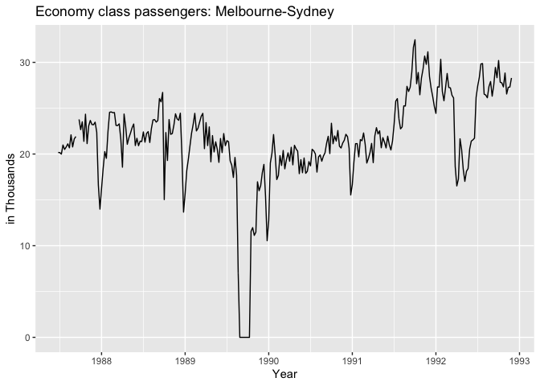
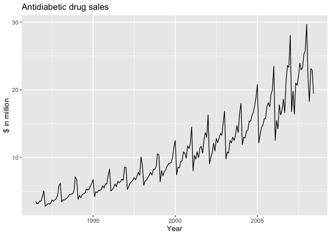
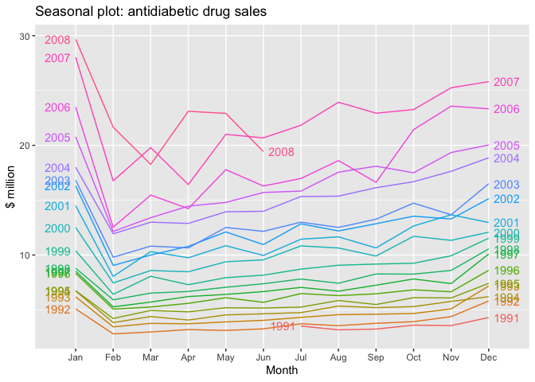
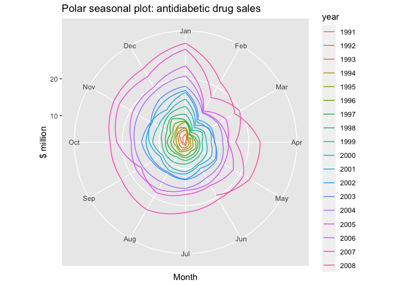
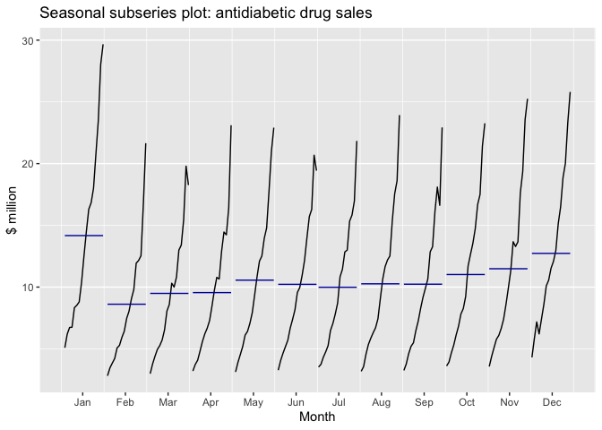
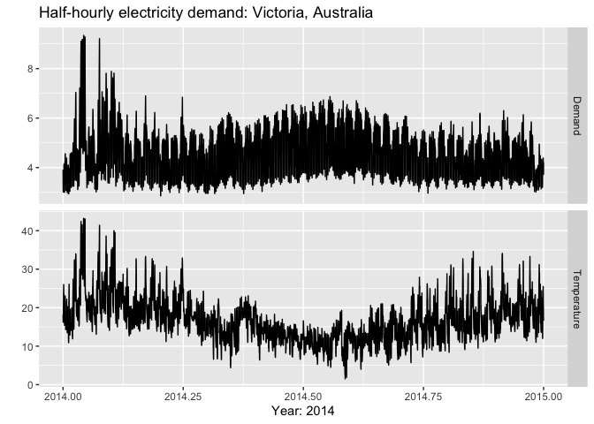
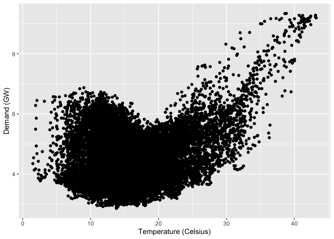
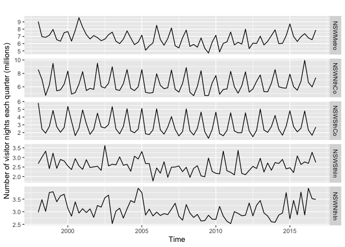
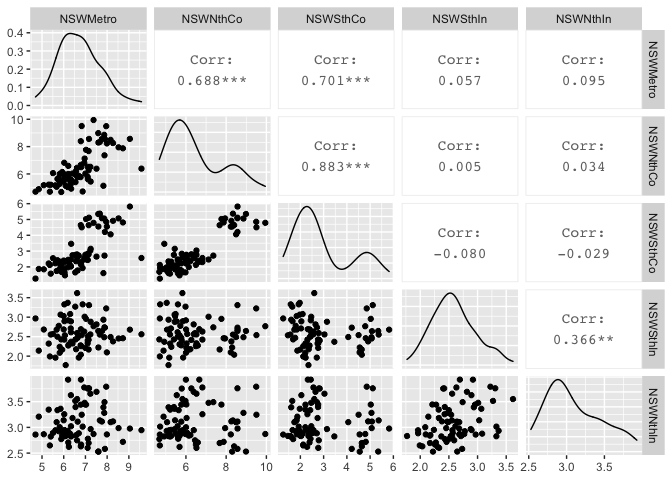

Time series graphics
================

### ts objects

``` r
y <- ts(c(123,39,78,52,110), start=2012)
y
```

    ## Time Series:
    ## Start = 2012 
    ## End = 2016 
    ## Frequency = 1 
    ## [1] 123  39  78  52 110

### Time plots

``` r
library(fpp)
```

    ## Loading required package: forecast

    ## Warning: package 'forecast' was built under R version 3.6.2

    ## Registered S3 method overwritten by 'quantmod':
    ##   method            from
    ##   as.zoo.data.frame zoo

    ## Loading required package: fma

    ## Loading required package: expsmooth

    ## Loading required package: lmtest

    ## Loading required package: zoo

    ## 
    ## Attaching package: 'zoo'

    ## The following objects are masked from 'package:base':
    ## 
    ##     as.Date, as.Date.numeric

    ## Loading required package: tseries

``` r
library(forecast)
library(ggplot2)
```

    ## Warning: package 'ggplot2' was built under R version 3.6.2

``` r
class(melsyd)
```

    ## [1] "mts" "ts"

``` r
head(melsyd)
```

    ## Time Series:
    ## Start = c(1987, 26) 
    ## End = c(1987, 31) 
    ## Frequency = 52 
    ##          First.Class Business.Class Economy.Class
    ## 1987.481       1.912             NA        20.167
    ## 1987.500       1.848             NA        20.161
    ## 1987.519       1.856             NA        19.993
    ## 1987.538       2.142             NA        20.986
    ## 1987.558       2.118             NA        20.497
    ## 1987.577       2.048             NA        20.770

``` r
autoplot(melsyd[, "Economy.Class"]) + ggtitle("Economy class passengers: Melbourne-Sydney") +
  xlab("Year") + ylab("in Thousands")
```

<!-- -->

``` r
head(a10, 10)
```

    ##           Jan      Feb      Mar      Apr May Jun      Jul      Aug      Sep
    ## 1991                                             3.526591 3.180891 3.252221
    ## 1992 5.088335 2.814520 2.985811 3.204780                                   
    ##           Oct      Nov      Dec
    ## 1991 3.611003 3.565869 4.306371
    ## 1992

``` r
class(a10)
```

    ## [1] "ts"

``` r
autoplot(a10) + ggtitle("Antidiabetic drug sales") +
  ylab("$ in million") + xlab("Year")
```

<!-- -->

### Seasonal plots

``` r
ggseasonplot(a10, year.labels = TRUE, year.labels.left = TRUE) + 
    ylab("$ million") + ggtitle("Seasonal plot: antidiabetic drug sales")
```

<!-- -->

The data from each season are overlapped.

``` r
ggseasonplot(a10, polar=TRUE) + ylab("$ million") + 
    ggtitle("Polar seasonal plot: antidiabetic drug sales")
```

<!-- -->

### Seasonal subseries plots

``` r
ggsubseriesplot(a10) + ylab("$ million") +
  ggtitle("Seasonal subseries plot: antidiabetic drug sales")
```

<!-- -->

### Scatterplots

``` r
library(fpp2)
```

    ## Warning: package 'fpp2' was built under R version 3.6.2

    ## 
    ## Attaching package: 'fpp2'

    ## The following objects are masked from 'package:fpp':
    ## 
    ##     ausair, ausbeer, austa, austourists, debitcards, departures,
    ##     elecequip, euretail, guinearice, oil, sunspotarea, usmelec

``` r
head(elecdemand)
```

    ## Multi-Seasonal Time Series:
    ## Start: 2014 1
    ## Seasonal Periods: 48 336 17520
    ## Data:
    ##        Demand WorkDay Temperature
    ## [1,] 3.914647       0        18.2
    ## [2,] 3.672550       0        17.9
    ## [3,] 3.497539       0        17.6
    ## [4,] 3.339145       0        16.8
    ## [5,] 3.204313       0        16.3
    ## [6,] 3.100043       0        16.6

``` r
autoplot(elecdemand[,c("Demand","Temperature")], facets=TRUE) +
  xlab("Year: 2014") + ylab("") +
  ggtitle("Half-hourly electricity demand: Victoria, Australia")
```

<!-- -->

``` r
qplot(Temperature, Demand, data = as.data.frame(elecdemand)) + 
  ylab("Demand (GW)") + xlab("Temperature (Celsius)")
```

<!-- -->

``` r
autoplot(visnights[,1:5], facets=TRUE) +
  ylab("Number of visitor nights each quarter (millions)")
```

<!-- -->

``` r
GGally::ggpairs(as.data.frame(visnights[,1:5]))
```

    ## Registered S3 method overwritten by 'GGally':
    ##   method from   
    ##   +.gg   ggplot2

<!-- -->

``` r
GGally::ggpairs(as.data.frame(visnights[,1:5]))
```

<!-- -->
